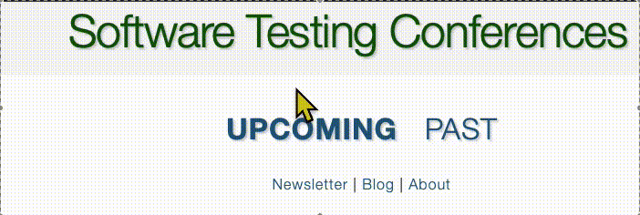

# [Testing Conferences](https://testingconferences.org) [](https://circleci.com/gh/TestingConferences/testingconferences.github.io) [](https://opensource.org/licenses/MIT) 

> [!IMPORTANT]
> We've switch TO `main` and away from `master` branch

> [!NOTE]
> You may need to update your remote origin target in git.

# TestingConferences.org


<p align="center">
  <a href="https://testingconferences.org" target="_blank" >
  
</p>


This is a simple list of **software testing conferences** and **workshops** published collaboratively with the testing community.

## Quick Start
1. Clone or download the project and cd project dir

```shell
git clone git@github.com:TestingConferences/testingconferences.github.io.git
cd testingconferences.github.io
```

2. Make sure you've got Docker (or Orbstack) installed and Run the setup process 
```shell
/devops/setup.sh
```

## Contributing Guidelines
The list of events is driven by files in the ```_data``` folder - if you have an update for those things, just change the ```current.yml``` and ```past.yml``` files and send a PR.
  - The _order_ of the events listed in ```current.yml``` and ```past.yml``` dictates the _order_ displayed, please make sure to properly insert events.
  - If possible, spell out the conference name and add the abbreviation. Otherwise just use the abbreviation:
    - Example: Workshop on Performance and Reliability (WOPR)
  - If the conference name has a colon (:), place the entire name in quotes. Otherwise this can cause build errors. 
    - Example: ```"test:fest 2099"``` or ```"IBCU: Workshop on Testing 2099"``` 
  - Include the year
    - Sometimes workshops use a version instead of a year
      - Example: Workshop on Performance and Reliability (WOPR) 24
  - Don't include the @ symbol for the twitter handle. If there is no twitter option, leave it blank
  - Optionally include a status such as:
    - CFP is open / closed (CFP == Call for Proposal)
    - CFP is closed
    - Early Bird Registration is open
    - Registration is open / closed
    - Feel free to put in dates about when things expire
    - Feel free to put the status as a link to the correct place
  - Optionally include a link to a conference video playlist. This will only appear for past conferences and can be added directly to the ```past.yml``` file.
    - These should be videos from the conference presentations or talks. No marketing videos please.  

## Eligible Conferences and Workshops

Focus is a goal of this project and as a result, only conferences, un-conferences and workshops that are specifically for software testing are listed. That means that if a conference covers software testing, but is not specifically for testers, then it is left out.

A good _heuristic_ for whether a conference should be included is if its name includes Test(ing) or Quality and/or how it describes itself.

## Mailing List

Don't forget to **[sign up](http://eepurl.com/c4paYT)** for our once **monthly newsletter.**


## Calendar Download

The site provides a downloadable calendar file (iCal/ICS format) that can be imported into calendar applications like Google Calendar, Apple Calendar, or Outlook. The calendar is automatically generated from the conference data and is available at:

```
https://testingconferences.org/calendar.ics
```

This feature allows users to easily import all upcoming testing conferences into their calendar application.

### Data Format

Conference entries in `_data/current.yml` include `start_date` and `end_date` fields in YYYY-MM-DD format, which are used to generate the calendar. When adding new conferences, please include these fields along with the human-readable `dates` field.

**Important**: The `end_date` should be set to **one day after** the last day of the conference, as per the ICS specification for all-day events.

Example:
```yaml
- name: Example Conference 2026
  location: City, Country
  dates: "January 22-24, 2026"
  start_date: "2026-01-22"
  end_date: "2026-01-25"  # One day after the conference ends
  url: https://example.com
```

## License

TC.org is released under the [MIT License](MIT-LICENSE).

[](https://saucelabs.com)
