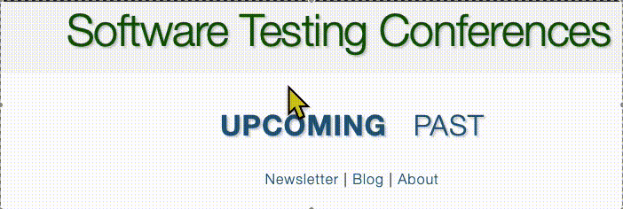

# [Testing Conferences](https://testingconferences.org) [](https://github.com/TestingConferences/testingconferences.github.io/actions/workflows/ci.yml) [](https://opensource.org/licenses/MIT)

> [!IMPORTANT]
> We've switch TO `main` and away from `master` branch

> [!NOTE]
> You may need to update your remote origin target in git.

# TestingConferences.org


<p align="center">
  <a href="https://testingconferences.org" target="_blank" >
  
</p>


This is a simple list of **software testing conferences** and **workshops** published collaboratively with the testing community.

## Quick Start
1. Clone or download the project and cd project dir

```shell
git clone git@github.com:TestingConferences/testingconferences.github.io.git
cd testingconferences.github.io
```

2. Make sure you've got Docker (or Orbstack) installed and Run the setup process 
```shell
/devops/setup.sh
```

## Contributing Guidelines
The list of events is driven by files in the ```_data``` folder - if you have an update for those things, just change the relevant data file (currently ```current.yml```, ```past.yml```, or ```closed.yml```) and send a PR.
  - The _order_ of the events listed in the data files dictates the _order_ displayed, please make sure to properly insert events.
  - If possible, spell out the conference name and add the abbreviation. Otherwise just use the abbreviation:
    - Example: Workshop on Performance and Reliability (WOPR)
  - If the conference name has a colon (:), place the entire name in quotes. Otherwise this can cause build errors. 
    - Example: ```"test:fest 2099"``` or ```"IBCU: Workshop on Testing 2099"``` 
  - Include the year
    - Sometimes workshops use a version instead of a year
      - Example: Workshop on Performance and Reliability (WOPR) 24
  - Closed conferences can use ```closed.yml``` and include:
    - ```first_date``` for the first known event date
    - ```last_date``` for the last known event date
  - Don't include the @ symbol for the twitter handle. If there is no twitter option, leave it blank
  - Optionally include a status such as:
    - CFP is open / closed (CFP == Call for Proposal)
    - CFP is closed
    - Early Bird Registration is open
    - Registration is open / closed
    - Feel free to put in dates about when things expire
    - Feel free to put the status as a link to the correct place
  - Optionally include a link to a conference video playlist. This will only appear for past conferences and can be added directly to the ```past.yml``` file.
    - These should be videos from the conference presentations or talks. No marketing videos please.  

Use official sources for event updates:
  - Prefer the conference website or the organizer's official registration, CFP, or schedule page.
  - Use official social accounts only when the website is stale or incomplete.
  - When sources conflict, prefer the most specific current-year event page over a generic homepage or archived page.
  - Do not guess dates, locations, prices, CFP deadlines, or registration status.
  - If useful for visitors, preserve uncertainty in the ```status``` field rather than presenting unclear information as confirmed.

Do not edit files in ```_site``` directly. That directory is generated by Jekyll; update the source files and regenerate the site instead.

## Eligible Conferences and Workshops

Focus is a goal of this project and as a result, only conferences, un-conferences and workshops that are specifically for software testing are listed. That means that if a conference covers software testing, but is not specifically for testers, then it is left out.

A good _heuristic_ for whether a conference should be included is if its name includes Test(ing) or Quality and/or how it describes itself.

## Mailing List

Don't forget to **[sign up](http://eepurl.com/c4paYT)** for our once **monthly newsletter.**

## Versioning and Deployments

The site uses an automated versioning system to track each deployment:

- **Version Number**: Every deployment to production automatically increments the version number stored in `_includes/VERSION.txt`
- **Git Tags**: Each deployment is tagged in Git with the format `vXXXX` (e.g., `v1501`)
- **Footer Display**: The current version is displayed in the site footer as `rev.XXXX.`
- **GitHub Pages**: Production is configured to deploy from the `main` branch.
- **GitHub Actions**: Validates conference data, builds the site, runs htmlproofer, and manages the version/tag release flow.

This versioning system enables:
- Tracking which version of the site is deployed
- Associating bug reports with specific deployments
- Measuring quality metrics across versions (see [ROADMAP.md](ROADMAP.md))


## License

TC.org is released under the [MIT License](MIT-LICENSE).
